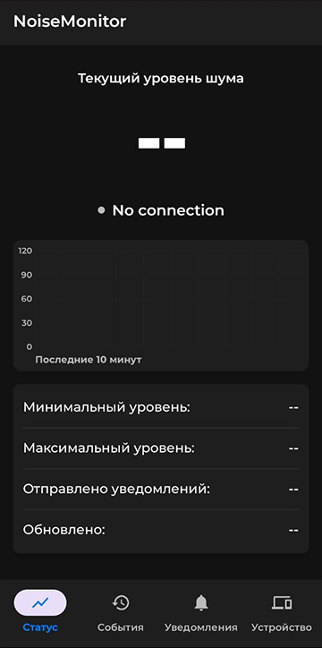
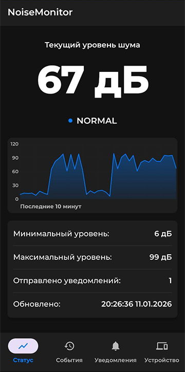

# Noise Monitor

Android-приложение для мониторинга уровня шума с внешнего устройства.

## Функционал
- Отображение текущего уровня шума и статистики за день
- График за последние 10 минут
- Информация об измерениях и отправленных уведомлениях
- Информация об устройстве, перезагрузка устройства

## Технологии
- Kotlin + XML
- Retrofit

## Демо приложения

### 1. Главный экран (Статус)
 

### 2. Экран измерений (События)

### 3. Экран оповещений (Уведомления)

### 4. Экран устройства и настроек приложения (Устройство)
